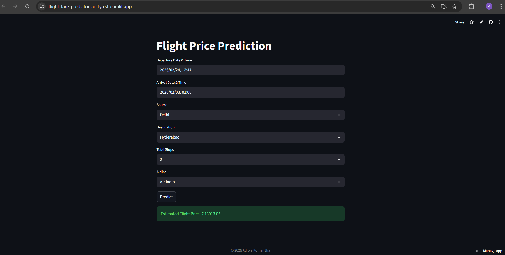

# ✈️ Flight Fare Prediction - End to End Machine Learning Project

## 📝 Overview
This is a high-performance Machine Learning web application that predicts flight ticket fares in India. The project uses a **Random Forest Regressor** optimized with **Hyperparameter Tuning** to estimate prices based on airlines, routes, and travel timings.

## 🚀 Live Demo
Check out the live application here: 
https://flight-fare-predictor-aditya.streamlit.app/

## 🖼️ Project Screenshot


## ✨ Key Features
- **Hyperparameter Tuning:** Optimized using `RandomizedSearchCV` to achieve the best model performance and minimize error rates (MAE, MSE).  
- **Advanced Feature Engineering:** Extracted critical insights from temporal data like Journey Day, Month, and Arrival/Departure timings.  
- **Smart Encoding:** Implemented One-Hot Encoding for categorical variables like Airlines, Source, and Destination.  
- **Real-time Prediction:** A responsive dashboard built with Streamlit for instant price estimation.  

## 🏗️ Technical Architecture
- **Data Preprocessing:** Handled missing values and transformed date-time strings into numeric features using Pandas.  
- **Model Training:** Utilized a Random Forest Regressor to capture complex non-linear relationships in airfare data.  
- **Optimization:** Fine-tuned parameters like `n_estimators`, `max_depth`, and `min_samples_split` for maximum accuracy.  
- **Deployment:** Serialized the model into `flight_rf.pkl` and deployed via Streamlit Cloud.  

## 🛠️ Tech Stack & Technologies Used
- **Frontend:** Streamlit (Web Framework)  
- **Machine Learning:** Scikit-learn (Random Forest, RandomizedSearchCV)  
- **Data Manipulation:** Pandas, Numpy  
- **IDE:** VS Code & Google Colab  
- **Deployment:** Streamlit Cloud  

## 📁 Directory Tree
```
├── app.py                      # Main Streamlit application backend
├── flight_fare_prediction.ipynb # Model Training & Hyperparameter Tuning Notebook
├── flight_rf.pkl               # Tuned Random Forest Model (Pickle file)
├── requirements.txt            # Project Dependencies
└── README.md                   # Project Documentation
```
## 📊 Dataset
The model is trained on the popular Flight Fare dataset from Kaggle.  

- Dataset Link:
  https://www.kaggle.com/datasets/nikhilmittal/flight-fare-prediction-mh

## ⚙️ Installation
To run this project locally, clone the repository and install the dependencies:

```bash
git clone https://github.com/adityajha27/flight-fare-app.git
cd flight-fare-app
pip install -r requirements.txt
streamlit run app.py
```

Developed with ❤️ by **Aditya Jha**
---